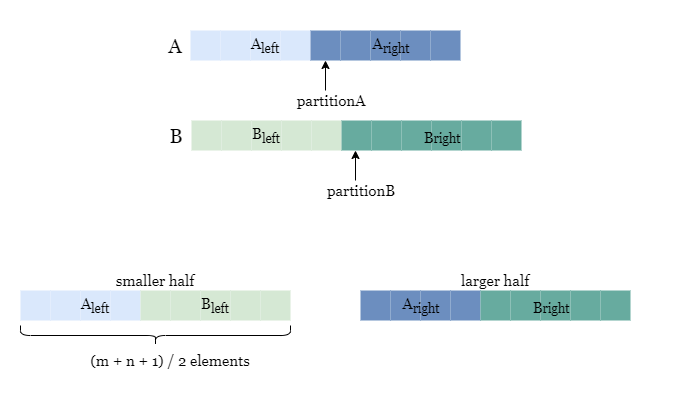

Recall the previous approach where we perform a binary search over the 'merged' array consisting of nums1 and nums2, resulting in a time complexity of O(log(m⋅n)). We could further improve the algorithm by performing the binary search only on the smaller array of nums1 and nums2, thus the time complexity is reduced to O(log(min(m,n))).

The main idea is similar to approach 2, where we need to find a point of partition in both arrays such that the maximum of the smaller half is less than or equal to the minimum of the larger half.

However, instead of partitioning over the merged arrays, we can only focus on partitioning the smaller array (let's call this array A). Suppose the partition index is partitionA, we specify that the smaller half contains (m + n + 1) / 2 elements, and we can use this feature to our advantage by directly making partitionB equal to (m + n + 1) / 2 - partitionA, thus the smaller halves of both arrays always contain a total of (m + n + 1) / 2 elements, as shown in the picture below.

